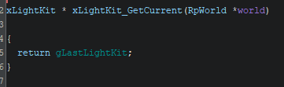
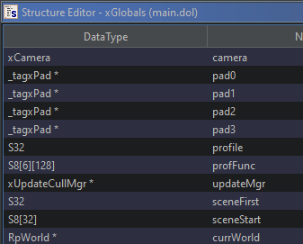
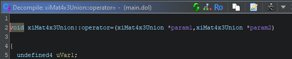

# Ghidra Importer

## What do you get from using the importer?

`bfbb_import` is a script which take basic symbols from the original game (in symbols.txt), and more detailed symbols from the reverse engineered code we can compile so far, and imports them into a Ghidra for easier reverse engineering.

Results of running the import:

* Full parameter type, return type information, parameter names, global variable types etc are imported for the contents of cpp files listed as `Matching` in `configure.py`:

* 

* All struct types referenced in `Matching` files are imported:

* 

* Name and parameter types but _not_ return types are imported for other name mangled functions in `symbols.txt`:

* 

* All other remaining symbols from `symbols.txt` are annotated in some way in the main Ghidra listing via labels.

## Import Instructions

### Step 1: Install Ghidra

Download and "install" a recent version of Ghidra from https://github.com/NationalSecurityAgency/ghidra/releases. "Install" here just means unzipping the folder, there is no global install process for Ghidra.

Note: You may need to install the JDK if you don't have it already. You will be prompted for this when running Ghidra if you don't have it.

### Step 2: Install the DOL Extension

Ghidra can't understand Gamecube DOL files out of the box. Install the Ghidra Gamecube loader from https://github.com/Cuyler36/Ghidra-GameCube-Loader/releases.

### Step 3: Import the DOL

Open Ghidra and `File > Import File...`, selecting the DOL file you put in `bfbb/orig/GQPE78/sys/main.dol` when setting up the repo.

Open up the imported file and ***allow analysis to run when prompted***. This importer script expects the functions to already be created by analysis.

### Step 4: Install Ghidrathon

We need to give Ghidra the ability to run Python 3 code, we do this with the Ghidrathon extension. Download Ghidrathon from the releases page: https://github.com/mandiant/Ghidrathon/releases

Follow the installation instructions on that page. You probably don't need to create a venv in this case, but you do need to run `ghidrathon_configure.py`.

### Step 5: Add Script Directory

In Ghidra, `Window > Script Manager` to open the script manager. This is what we ill use to run the script.

In the script manager, at the top right, click the "Manage Script Directories" button: 

Click `+` at the top right of the script manager, and add `bfbb/ghidra_scripts` to the list of script directories.

### Step 6: Run the Importer

In the Script Manager, you should now be able to filter for `bfbb_import.py`. Select it and run it through the context menu or the run button at the top of the Script Manager.

Importing will take as long as a clean build does because we temporarily have to make a debug build of the executable to get the parameter names and other info from already reverse engineered functions (the script will restore your previous build settings after doing so)

### Step 7: Enjoy The Results

Most functions should now have name / parameter info rather than just being FUN_xxxxxxxx. No more having to look stuff up in symbols.txt!

<!-- ## Ghidra Basics

TODO: Basic guide on using Ghidra -->
